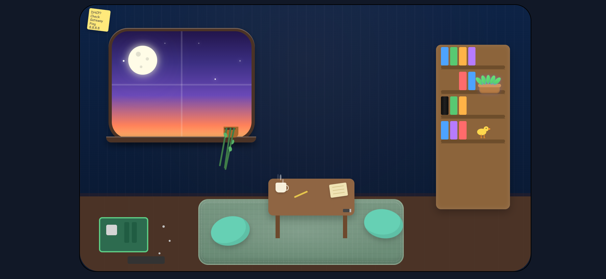
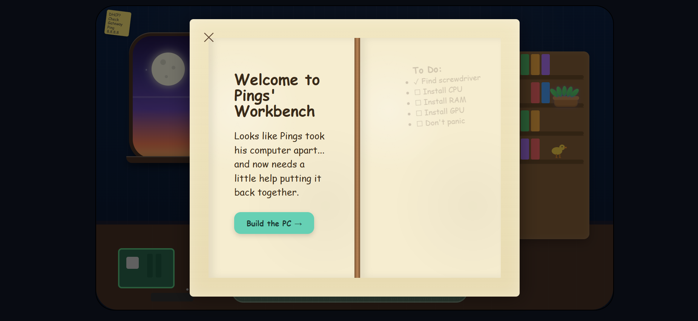

ByteGuard
Live Site: byteguard.onrender.com

An interactive IT learning platform where networking, computer hardware, and troubleshooting come to life through exploration.

ByteGuard is a full-stack educational web application built with Flask, JavaScript, HTML, and CSS. Instead of presenting users with walls of documentation, ByteGuard teaches technical concepts through an interactive environment filled with clickable objects, hands-on activities, and guided labs.

Whether you’re learning how to troubleshoot a network, identify PC components, or explore computer hardware, ByteGuard encourages users to learn by interacting rather than simply reading.

⸻

Features

Interactive Hardware Workshop

Help Pings rebuild his computer while learning what each hardware component does and where it belongs.

Interactive Bookshelf

Browse books that open into beginner-friendly lessons covering networking, hardware, and cybersecurity topics.

Networking Tools

Practice troubleshooting using interactive utilities and networking concepts inspired by real-world IT workflows.

Pings

Meet Pings, ByteGuard’s robot assistant. He guides users through lessons, projects, and troubleshooting challenges.

Byte

Byte is the resident cat and unofficial guardian of the lab. He mostly supervises… and occasionally judges your cable management.

Cozy Learning Environment

Every piece of the interface—from the moonlit window to the coffee table—is custom designed to create a welcoming place to learn.

⸻

Built With

* Python
* Flask
* HTML5
* CSS3
* JavaScript
* REST APIs

⸻

Project Goals

ByteGuard was created to answer one question:

“What if learning IT felt more like exploring a game than reading a textbook?”

The project focuses on making technical education approachable through visual design, interactivity, and experimentation.

Current areas include:

* Networking
* Computer Hardware
* Troubleshooting
* Cybersecurity fundamentals
* Interactive educational experiences

⸻

Current Development

ByteGuard is actively being expanded with:

* Interactive PC building lab
* Animated robot companion (Pings)
* Clickable educational objects
* Hardware lessons
* Networking simulations
* Additional cybersecurity content

⸻

Why I Built ByteGuard

Many people interested in IT become discouraged because learning resources can feel overwhelming or overly technical.

ByteGuard is my attempt to make technical education feel welcoming, creative, and engaging by combining software development with interactive educational design.
